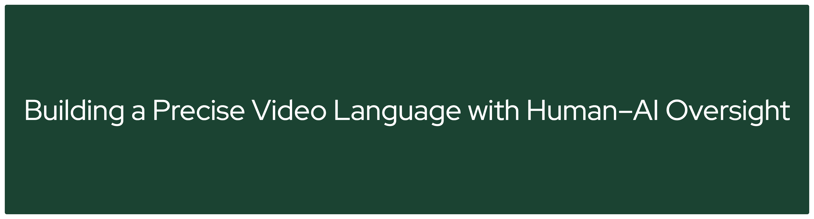

# CHAI

<!-- TODO: Add banner image -->
<!--  -->

**Official Codebase for CVPR 2026 Highlight Paper:**
*"Building a Precise Video Language with Human–AI Oversight"*

**Note: More content will be added to the repo soon (model, videos, etc.)! Stay tuned.**


<!-- TODO: Add badges -->
<!-- [](https://arxiv.org/abs/XXXX.XXXXX) -->
<!-- [](https://TODO-project-url.github.io) -->

[Zhiqiu Lin](https://linzhiqiu.github.io/)¹,
[Chancharik Mitra](https://chancharikmitra.github.io/)¹,
[Siyuan Cen](https://sy77777en.github.io/)¹,
[Isaac Li](https://www.linkedin.com/in/isaac-li-bb381b284/)¹,
Yuhan Huang¹,
[Yu Tong Tiffany Ling](https://www.yttldesign.com/)¹,
[Hewei Wang](https://github.com/WangHewei16)³,
Irene Pi¹,
Shihang Zhu¹,
Ryan Rao¹,
George Liu¹,
Jiaxi Li¹,
Ruojin Li¹,
Yili Han¹,
[Yilun Du](https://yilundu.github.io/)²,
[Deva Ramanan](https://www.cs.cmu.edu/~deva/)¹

¹Carnegie Mellon University &nbsp; ²Harvard University &nbsp; ³Apple

---

## Overview

Video–language models learn to reason about dynamic scenes through natural language, yet producing precise video captions remains challenging. **CHAI (Critique-based Human–AI)** is an oversight framework that pairs trained human experts with model-generated pre-captions: experts provide correctional critiques that guide revisions into improved post-captions. This division of labor offloads text generation to models so that humans can focus on verification, improving both accuracy and efficiency.

We release open datasets, benchmarks, and training recipes built on a structured captioning specification covering **subjects, scenes, motion, spatial layout, and camera dynamics**—grounded in hundreds of visual primitives developed with professional filmmakers. The resulting critiques and preferences provide rich supervision for improving open-source VLMs (Qwen3-VL) through SFT, DPO, and inference-time scaling on three tasks: caption generation, reward modeling, and critique generation.

<!-- TODO: Add teaser figure -->
<!--  -->

---

## Evaluation Data

All evaluation files live under `eval_data/`. The raw test split and three task-specific reformatted versions are provided.

### `test_split.json`
The raw evaluation data. Each entry contains a video path, the model-generated **pre-caption**, a human-written **critique**, the revised **final caption** (post-caption), a **pre-caption score** (1–5), the **caption type** (e.g., Subject, Scene, Motion, Spatial, Camera), and associated metadata. This file serves as the source from which all task-specific evaluation sets below are derived.

### `eval_caption_generation_test.json`
Formatted for the **caption generation** task. Each sample pairs a video with a task instruction as the user turn and the final (post) caption as the target assistant response. Used to evaluate a model's ability to directly produce high-quality captions from video.

### `eval_critique_generation_test.json`
Formatted for the **critique generation** task. Each sample provides a video, a task instruction, and a caption to critique as the user turn. The target assistant response is a critique. For pre-captions scoring below 5, two training pairs are generated: one pairing the pre-caption with its human critique, and one pairing the final caption with a "perfect caption" sentinel critique, teaching the model to both identify errors and recognize when a caption needs no revision.

### `eval_caption_yes_or_no_test.json`
Formatted for the **reward modeling** (binary alignment scoring) task. Given a video, a task instruction, and a candidate caption, the model must judge whether the caption aligns with the video by responding **"Yes"** or **"No"**. For pre-captions scoring below 5, two samples are generated: the final caption as a positive example ("Yes") and the pre-caption as a negative example ("No"), providing balanced supervision for learning caption quality.

---

<!-- ## Getting Started -->

<!-- TODO: Installation, environment setup, data download instructions -->

<!-- ```bash -->
<!-- # Clone the repository -->
<!-- git clone https://github.com/TODO/CHAI.git -->
<!-- cd CHAI -->

<!-- # Install dependencies -->
<!-- pip install -e . -->
<!-- ``` -->

<!-- TODO: Add usage examples / quickstart -->

---

## Citation

If you find this work useful, please cite:

```bibtex
@inproceedings{chai2026,
  title     = {Building a Precise Video Language with Human--AI Oversight},
  author    = {Zhiqiu Lin and Chancharik Mitra and Siyuan Cen and Isaac Li and Yuhan Huang and Yu Tong Tiffany Ling and Hewei Wang and Irene Pi and Shihang Zhu and Ryan Rao and George Liu and Jiaxi Li and Ruojin Li and Yili Han and Yilun Du and Deva Ramanan},
  booktitle = {Proceedings of the IEEE/CVF Conference on Computer Vision and Pattern Recognition (CVPR)},
  year      = {2026}
}
```

---
## 📢 Collaborations & Contact

We are actively advancing CHAI with larger-scale datasets and stronger video
understanding models. We welcome collaborations and funding opportunities with
researchers and practitioners working on video understanding, captioning, and
multimodal agents for professional-level video content.

If you're interested in accessing improved data or models, please reach out:

- Zhiqiu Lin — [zhiqiulin98@gmail.com](mailto:zhiqiulin98@gmail.com)
- Chancharik Mitra — [cmitra@andrew.cmu.edu](mailto:cmitra@andrew.cmu.edu)

Or [open a GitHub Issue](../../issues).

---

## Acknowledgments

This material is based upon work supported by the National Science Foundation Graduate Research Fellowship Program under Grant No. DGE2140739. Any opinions, findings, and conclusions or recommendations expressed in this material are those of the author(s) and do not necessarily reflect the views of the National Science Foundation.

<!-- TODO: Additional funding, collaborators, professional video creators -->

## License

<!-- TODO: Specify license -->
